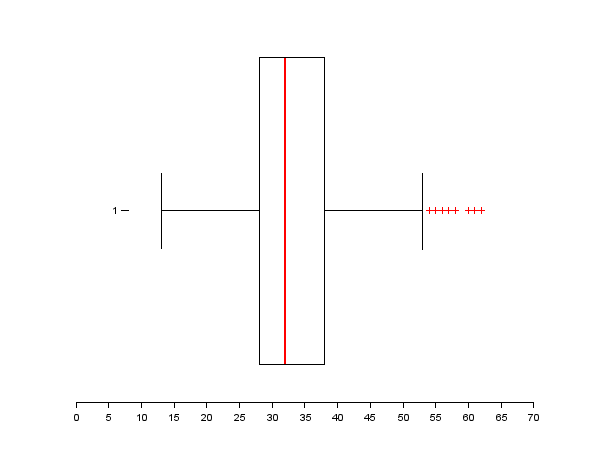
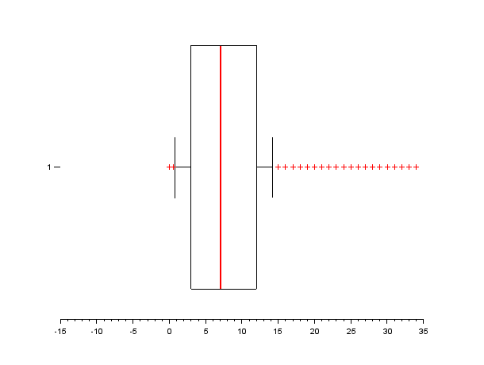
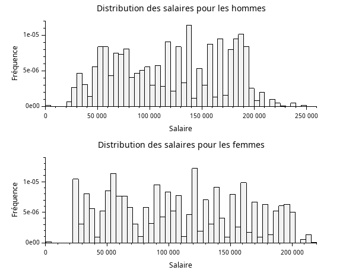
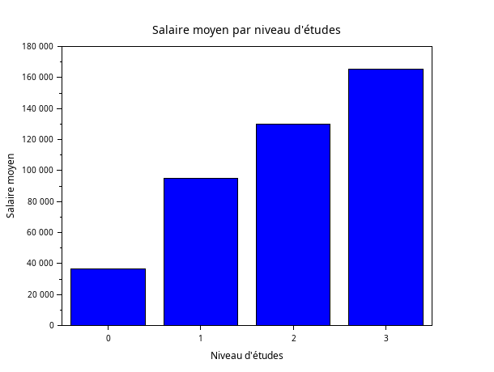
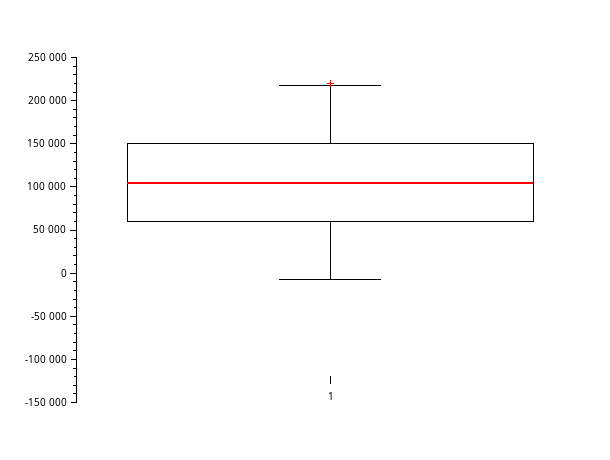
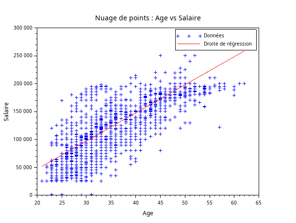
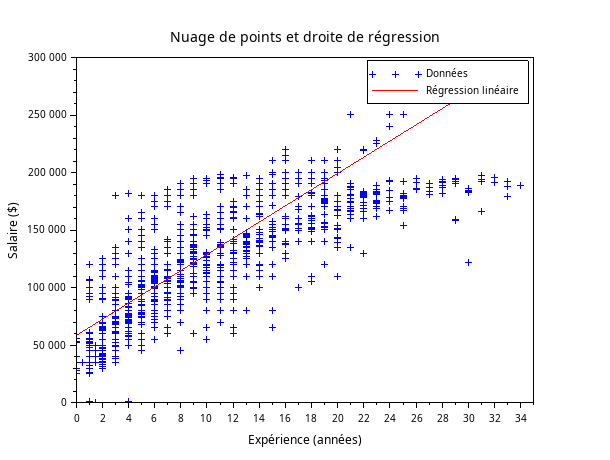
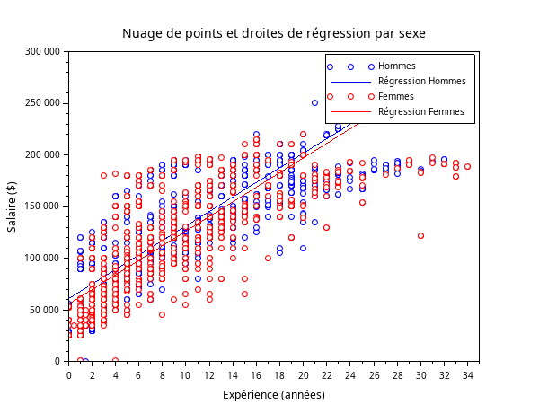
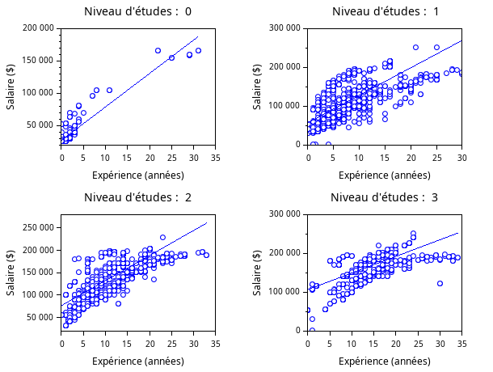

# EXO 1:
**Données:**

* X = csvRead('data.csv',[],[],'double') ==> les chiffres
* Y = csvRead('data.csv',[],[],'double') ==>female et males

  **Question 1:**  Donnez sous forme de camembert la répartition des genres.

* genre = tabul(csvString(:,3),"i")            

&#x2794; cela permet de récupèrer la liste des genres ainsi que leur occurence

        ->genre(1)
        ->genre(2)                                      
&#x2794; Donne l'occurence correspondant aux valeurs de "genre(1)"

    pie(genre(2),genre(1))                              
&#x2794; fais sous forme d'un camembert la representation des genres en fonction de leur occurence

**Résultat**

  **Question 2:** Donnez sous forme d'histogramme la répartition des niveaux d'études, suivants le genre.

**Reponse:**

* genre_lvl = [csvString(:,3),csvString(:,4)]                                     
&#x2794; crée une matrice 6699x2 avec les genres et le niveau d'études

* high_homme = length(find(genre_lvl(:,2) == "0" & genre_lvl(:,1) == "Male"))     
&#x2794; renvoie l'occurence d'hommes ayant un niveau d'étude de 0

* high_femme = length(find(genre_lvl(:,2) == "0" & genre_lvl(:,1) == "Female"))   
&#x2794; renvoie l'occurence des femmes ayant un niveau d'étude de 0

* high_autre = length(find(genre_lvl(:,2) == "0" & genre_lvl(:,1) == "Other"))    
&#x2794; renvoie l'occurence des autres ayant un niveau d'étude de 0

* b_homme = length(find(genre_lvl(:,2) == "1" & genre_lvl(:,1) == "Male"))        
&#x2794;  renvoie l'occurence d'hommes ayant un niveau d'étude de 1

* b_femme = length(find(genre_lvl(:,2) == "1" & genre_lvl(:,1) == "Female"))      
&#x2794;  renvoie l'occurence des femmes ayant un niveau d'étude de 1

* b_autre = length(find(genre_lvl(:,2) == "1" & genre_lvl(:,1) == "Other"))       
&#x2794; renvoie l'occurence des autres ayant un niveau d'étude de 1

* m_homme = length(find(genre_lvl(:,2) == "2" & genre_lvl(:,1) == "Male"))        
&#x2794; renvoie l'occurence des hommes ayant un niveau d'étude de 2

* m_femme = length(find(genre_lvl(:,2) == "2" & genre_lvl(:,1) == "Female"))      
&#x2794; renvoie l'occurence des femmes ayant un niveau d'étude de 2

* m_autre = length(find(genre_lvl(:,2) == "2" & genre_lvl(:,1) == "Other"))       
&#x2794; renvoie l'occurence des autres ayant un niveau d'étude de 2

* d_homme = length(find(genre_lvl(:,2) == "3" & genre_lvl(:,1) == "Male"))        
&#x2794; renvoie l'occurence des hommes ayant un niveau d'étude de 3

* d_femme = length(find(genre_lvl(:,2) == "3" & genre_lvl(:,1) == "Female"))      
&#x2794;  renvoie l'occurence des femmes ayant un niveau d'étude de 3

* d_autre = length(find(genre_lvl(:,2) == "3" & genre_lvl(:,1) == "Other"))       
&#x2794; renvoie l'occurence des autres ayant un niveau d'étude de 3

* temp = [high_homme, high_femme, high_autre;b_homme, b_femme, b_autre;m_homme, m_femme, m_autre;d_homme, d_femme, d_autre]   
&#x2794; crée un tableau 

==>   lvlEtude = [0,1,2,3]

==>   bar(lvlEtude,temp);

==>  legend("homme","femme","autre")

**Résultat:**

**Question3:** Donnez sous forme d'histogramme, les effectifs des 10 professions les plus représentées.

**Réponse:**

* metiers = tabul(csvString(:,5),"i")                                 

&#x2794; récupère la liste des profession ainsi que leur occurence

* [occu,indice] = gsort(metiers(2))                                   

&#x2794; donne la liste des occurence trié ainsi que l'indice que son indice avant le 

* profession = metiers(1)                                             

&#x2794; stock la liste des profession dans une variable

* matrice_occurence = [occu(1:1),occu(2:2),occu(3:3),occu(4:4),occu(5:5),occu(6:6),occu(7:7),occu(8:8),occu(9:9),occu(10:10)]

* bar(matrice_occurence)                                              

&#x2794; affiche l'histogramme des 10 professions avec le plus de monde

* legend(profession(indice(1:10)))                                    

&#x2794; légende le graphe pour donner un nom à chaque colonne

**Résultat:**

**Question 4:**  Quelle est la profession la plus fréquente des femmes ? des hommes ?

**Réponse:**

* indice_female = find(csvString(:,3) == "Female")        

&#x2794;récupère les indice de la colonne 3 de data.csv contenant "Female"

* [valeurs] = csvString(indice_female,5)                  

&#x2794;récupère les métiers situés aux indices récupérés précédemment

* metiers_female = tabul(valeurs)                         

&#x2794;récupère les métiers sans doublons ainsi que leur occurence

* [occurence_tri,indice_tri] = gsort(metiers_female(2))   

&#x2794;récupère et trie dans un tableau ce qu'on a relevé précédemment et relève leur indice d'avant

* liste_metiers_female = metiers_female(1)                

&#x2794;récupère dans une variable la liste des métiers unique dans le but de la parcourir par indice

* liste_metiers_female(119)                               

&#x2794;relève le métiers recensant le plus de femmes

 * indice_male = find(csvString(:,3) == "Male")            
 
 &#x2794;récupère les les indice de la colonne 3 de data.csv contenant "Male"

* [valeurs2] = csvString(indice_male,5)                   

&#x2794;récupère les métiers situés aux indices récupérés précédemment

* metiers_male = tabul(valeurs2)                          

&#x2794;récupère les métiers sans doublons ainsi que leur occurence

* [occurence_tri,indice_tri] = gsort(metiers_male(2))     

&#x2794;récupère et trie dans un tableau ce qu'on a relevé précédemment et relève leur indice d'avant

* liste_metiers_male = metiers_male(1)                    

&#x2794;récupère dans une variable la liste des métiers unique dans le but de la parcourir par indice

* liste_metiers_male(11)                                  

&#x2794; relève le métiers recensant le plus d'hommes

**Cela renvoie comme réponse:**
 _________       _______________________
|**Homme**| ==> | **Software Engineer** |
|_________|     |_______________________|

                                                        
 _________       ____________________
|**Femme**| ==> | **Data Scientist** |
|_________|     |____________________|

  **Question5:**   Pour chaque niveau d'études, donnez le salaire moyen, l'âge moyen et l'expérience moyenne.

**Reponse:**

* indice_high = find(csvDouble(:,4) == 0 )

* salaire_high = csvDouble(indice_high,7)

* mean(salaire_high)                                      

&#x2794; *Cela donne comme résultat:* 36706.694

* age_high = csvDouble(indice_high,2)

* mean(age_high)                                          

&#x2794; *Cela donne comme résultat:* 26.854911

* exp_high = csvDouble(indice_high,6)

* mean(exp_high)                                          

&#x2794; *Cela donne comme résultat:* 1.9151786

* indice_b = find(csvDouble(:,4) == 1 )

* salaire_b = csvDouble(indice_b,7)

* mean(salaire_b)                                         

&#x2794; *Cela donne comme résultat:* 95082.909

* age_b = csvDouble(indice_b,2)

* mean(age_b)                                             

&#x2794; *Cela donne comme résultat:* 30.260179

* exp_b = csvDouble(indice_b,6)

* mean(exp_b)                                             

&#x2794; *Cela donne comme résultat:* 5.4195631

* indice_m = find(csvDouble(:,4) == 2 )

* salaire_m = csvDouble(indice_m,7)

* mean(salaire_m)                                         

&#x2794; *Cela donne comme résultat:* 130112.06

* age_m = csvDouble(indice_m,2)

* mean(age_m)                                             

&#x2794; *Cela donne comme résultat:* 35.171505

* exp_m = csvDouble(indice_m,6)

* mean(exp_m)                                             

&#x2794; *Cela donne comme résultat:* 9.6456989

* indice_p = find(csvDouble(:,4) == 3)

* salaire_p = csvDouble(indice_p,7)

* mean(salaire_p)                                         

&#x2794; *Cela donne comme résultat:* 165651.46

* age_p = csvDouble(indice_p,2)

* mean(age_p)                                             

&#x2794; *Cela donne comme résultat:* 41.154858

* exp_p = csvDouble(indice_p,6)

* 0mean(exp_p)                                             

&#x2794; *Cela donne comme résultat:* 13.915267

**Question 6:** Pour chaque genre, donnez le salaire moyen, l'âge moyen et l'expérience moyenne.

**Réponse:**

* indice_6_female = find(csvString(:,3) == "Female" )

* salaire_6_female = csvDouble(indice_6_female,7)

* mean(salaire_6_female)					                

&#x2794; *Cela donne comme résultat:* 107889.00

* age_6_female = csvDouble(indice_6_female,2)

* mean(age_6_female)					                    

&#x2794; *Cela donne comme résultat:* 32.626286

* exp_6_female = csvDouble(indice_6_female,6)

* mean(exp_6_female)					                    

&#x2794; *Cela donne comme résultat:* 7.4201792

* indice_6_male = find(csvString(:,3) == "Male" )

* salaire_6_male = csvDouble(indice_6_male,7)

* mean(salaire_6_male)					                

&#x2794; *Cela donne comme résultat:* 121389.87

* age_6_male = csvDouble(indice_6_male,2)

* mean(age_6_male)					                    

&#x2794; *Cela donne comme résultat:* 34.416394

* exp_6_male = csvDouble(indice_6_male,6)

* mean(exp_6_male)					                    

&#x2794; *Cela donne comme résultat:* 8.6169662

* indice_6_other = find(csvString(:,3) == "Other" )

* salaire_6_other = csvDouble(indice_6_other,7)

* mean(salaire_6_other)					                

&#x2794; *Cela donne comme résultat:* 125869.86

* age_6_other = csvDouble(indice_6_other,2)

* mean(age_6_other)					                    

&#x2794; *Cela donne comme résultat:* 39.571429

* exp_6_other = csvDouble(indice_6_other,6)

* mean(exp_6_other)					                    

&#x2794; *Cela donne comme résultat:* 16.428571

  

# EXO 2:

**question 1:** Donnez sous forme d'histogrammes la distribution des ages.

**Réponse:**

* age = X(:, 2);
* min_age = min(age); 
* max_age = max(age);  
* histplot(41,age);

**Resultat:**

**Question2:** Donnez sous forme d'histogrammes la distribution de l'expérience.

**Réponse:**

* exp = X(:,6);
* min_xp = min(exp);
* max_xp = max(exp);
* histplot(34,exp);

**Résultat:**

**Question 3:** Donnez les quartiles, interquatiles, min,max, moyenne, mediane, mode, et ecart type de l'age.

**Réponse:**

* Q = quart(age)

==> IQR = Q(3) - Q(1) 

* min_age = min(age);

* max_age = max(age);

* mean(age)

* median(age)

* unique_vals = unique(age);
* freq = histc(ages, unique_vals);
* [max_freq, max_index] = max(freq);
* age_mode = unique_vals(max_index);

**Question 4:** A l'aide du paquet stixbox, tracez une boite à moustache pour l'age.

**Réponse:**

 * atomsInstall("stixbox");
 * boxplot(age, "whisker", 0.25, "orientation", "horizontal");

**Résultat:**

 

**Question 5:** Refaire les questions précédentes pour l'expérience.

* Q = quart(exp) 
* IQR = Q(3) - Q(1)
* min_xp = min(exp); 
* max_xp = max(exp); 
* mean(exp)
* median(exp)

* Unique_vals = unique(exp);
* Freq = histc(exp, Unique_vals);
* [max_Freq, max_Index] = max(Freq);
* exp_mode = Unique_vals(max_Index);

 * boxplot(exp, "whisker", 0.25, "orientation", "horizontal");

**Résultat:**

# Exercice n°3:

**Données:**

* X= csvRead('data.csv');
* Y= csvRead('data.csv',',','.','string');

 
* genre = Y(:,3);

**Question 1:** Donnez, sous forme d'histogramme la distribution des salaires, suivant le genre.

**Réponse:**

* D_homme = D(genre == 'Male',:);

* D_femme = D(genre == 'Female',:);

* salaire_homme = D_homme(:,7);

* salaire_femme = D_femme(:,7);

* num_bins = 50;

* subplot(2, 1, 1);

* histplot(num_bins, salaire_homme);

* title("Distribution des salaires pour les hommes");

* xlabel("Salaire");

* ylabel("Fréquence");

* subplot(2, 1, 2); 

* histplot(num_bins, salaire_femme);

* title("Distribution des salaires pour les femmes");

* xlabel("Salaire");

* ylabel("Fréquence");

**Résultat:**

**Question 2:** Tracez un histogramme des salaires moyens suivants le niveau d'études.

**Réponse:**

* niveau_etudes = D(:, 4);

* salaires = D(:, 7);

* unique_niveaux = unique(niveau_etudes);

* moy_salaire_par_niveau = zeros(size(unique_niveaux));

* for i = 1:length(unique_niveaux)
 
 
    ==> moy_salaire_par_niveau(i) = mean(salaires(niveau_etudes == unique_niveaux(i)));

    ==>end

    ==>  bar(unique_niveaux, moy_salaire_par_niveau);

* xlabel("Niveau d''études");

* ylabel("Salaire moyen");

* title("Salaire moyen par niveau d''études");

**Résultat:**

**Question 3:**   Donnez les quartiles, interquatiles, min,max, moyenne, mediane, et ecart type des salaires. Tracez une boite à moustaches.

**Réponse:**

* Q = quart(salaires)

* IQR = Q(3) - Q(1);

* min_salaire = min(salaires)

* max_salaire = max(salaires)

* mean(salaires)

* median(salaires)

* stdev(salaires)

* boxplot(salaires, "orientation", "horizontal")

//interquartiles//
//equartilles//

**Question 4:**  Refaire la question précédente, en distingant les genres. Tracez une boîte à moustache pour chaque genre. Commentaires ? 

**Réponse:**

* QH = quart(salaire_homme)  

* QF = quart(salaire_femme)

* IQH = QH(3) - QH(1)   

* IQF = QF(3) - QF(1)

* min(salaire_homme)  

* min(salaire_femme)   

* max(salaire_homme)   

* max(salaire_femme)   

* mean(salaire_homme) 

* mean(salaire_femme)  

* median(salaire_homme) 

* median(salaire_femme)  

* stdev(salaire_homme) 

* stdev(salaire_femme) 

*Boite à moustache :*

&#x2794;boxplot(salaire_homme);
==> title("Boîte à moustaches des salaires des hommes");
==> ylabel("Salaires");
**Résultat:**

&#x2794;boxplot(salaire_femme);
==> title("Boîte à moustaches des salaires des femmes");
==> ylabel("Salaires");

#Exercice n°3:

**Question 1:** Tracez un nuage de points (age,salaire), et la droite de regression correspondante. Quel est le coefficient de corrélation ?

**Réponse:**  

* disp(size(age));

* disp(size(salaire)),;

==> clf;

&#x2794; Vérifier les dimensions

&#x2794;Tracer le nuage de points avec les vraies données

* scatter(age, salaire, 10, 'filled');

* xlabel('Age');

* ylabel('Salaire');

* title('Nuage de points : Age vs Salaire');

* A = [ones(length(age), 1), age];

* coefficients = A \ salaire;

* salaire_pred = A * coefficients;

&#x2794;Tracer le nuage de points avec les vraies données

* plot(age, salaire, '+'); 

==> Tracer le nuage de points

* plot(age, salaire_pred, '-r'); 

==> Tracer la droite de régression

* legend(['Données', 'Droite de régression'], 'Location', 'northwest');

&#x2794; Tracer la droite de régression

* mean_age = mean(age);

* mean_salaire = mean(salaire);

* numerateur = sum((age - mean_age) .* (salaire - mean_salaire));

* denominateur = sqrt(sum((age - mean_age).^2) * sum((salaire - mean_salaire).^2));

* correlation_coefficient = numerateur / denominateur;

&#x2794; Calcul manuel du coefficient de corrélation

* disp('Le coefficient de corrélation est :');

* disp(correlation_coefficient);     

**Ceci renvoie comme résultat:** 0.9376936

&#x2794; Affichage du coefficient de corrélation

**Résultat:**

   
   
   
**Question 2:** Tracez un nuage de points (expérience,salaire), et la droite de regression correspondante. Quel est le coefficient de corrélation ?

**Données:**

* data = csvRead("data.csv"); 

* experience = data(:, 6);

* salaire = data(:, 7); 

**Réponse:**

* n = length(experience);

* sum_x = sum(experience);

* sum_y = sum(salaire);

* sum_xy = sum(experience .* salaire);

* sum_x2 = sum(experience.^2);

* b = (n * sum_xy - sum_x * sum_y) / (n * sum_x2 - sum_x^2);

* a = (sum_y - b * sum_x) / n;

* clf;     ==>    permet de nettoyer 

* plot(experience, salaire, 'b+'); 

&#x2794; 'bo' pour des points bleus

* xlabel('Expérience (années)');

* ylabel('Salaire ($)');

* title('Nuage de points et droite de régression');

* y_pred = a + b * experience;

* plot(experience, y_pred, 'r-'); 

* legend(['Données', 'Régression linéaire'], 'location', 'northwest');

* mean_experience = mean(experience);

* mean_salaire = mean(salaire);

* numerator = sum((experience - mean_experience) .* (salaire - mean_salaire));

* denominator = sqrt(sum((experience - mean_experience).^2) * sum((salaire - mean_salaire).^2));

* correlation = numerator / denominator;

* disp("Coefficient de corrélation : " + string(correlation));

**Cela renvoie comme coefficient de corrélation : 0.8089689**

# Exercice n°5:

**Question 2:** Tracez un nuage de points (salaire,expérience) pour les hommes et les femmes, ainsi que les droites de regression associées. Commentaire ?

**Données:** 

* experience = X(:, 6);

* salaire = X(:, 7);

* sexe = Y(:, 3); 

&#x2794; Extraire les colonnes pertinentes (expérience, salaire, sexe)

**Réponse:**

* experience_hommes = experience(sexe == 'Male');

* salaire_hommes = salaire(sexe == 'Male');

* experience_femmes = experience(sexe == 'Female');

* salaire_femmes = salaire(sexe == 'Female');

&#x2794; Séparer les données pour les hommes et les femmes

* X_hommes = [ones(length(experience_hommes), 1), experience_hommes];

* coeffs_hommes = X_hommes \ salaire_hommes;

* salaire_pred_hommes = X_hommes * coeffs_hommes; 

&#x2794; Calcul de la régression linéaire pour les hommes (méthode des moindres carrés)

* X_femmes = [ones(length(experience_femmes), 1), experience_femmes];

* coeffs_femmes = X_femmes \ salaire_femmes;

* salaire_pred_femmes = X_femmes * coeffs_femmes; 

&#x2794;  Calcul de la régression linéaire pour les femmes (méthode des moindres carrés)

clf;

* plot(experience_hommes, salaire_hommes, 'bo'); // Nuage de points pour les hommes

* plot(experience_hommes, salaire_pred_hommes, 'b-'); // Droite de régression pour les hommes

* plot(experience_femmes, salaire_femmes, 'ro'); // Nuage de points pour les femmes

* plot(experience_femmes, salaire_pred_femmes, 'r-'); // Droite de régression pour les femmes

* xlabel('Expérience (années)');

* ylabel('Salaire ($)');

* title('Nuage de points et droites de régression par sexe');

* legend(['Hommes', 'Régression Hommes', 'Femmes', 'Régression Femmes'], 'location', 'northwest');

    
&#x2794; Tracer le nuage de points et les droites de régression

**Résultat:**

    

**Question 2:**Tracez un nuage de points (salaire,expérince) et les droites de regression associées pour chaque niveau d'études. Commentaire ?

**Données:**

* X = csvRead('data.csv');
* experience = X(:, 6);
* salaire = X(:, 7);

**Réponse:**

* X = csvRead('data.csv');

* experience = D(:, 6);

* salaire = D(:, 7);

&#x2794;  Charger les données

* niveau_etudes = D(:, 4); 
&#x2794; Supposons que la colonne 4 contient les niveaux d'études

niveaux = unique(niveau_etudes);
&#x2794; Obtenir les différents niveaux d'études

*Tracer le nuage de points et les droites de régression pour chaque niveau d'études*

clf;

* for i = 1:length(niveaux)

    niveau = niveaux(i);

     indices_niveau = find(niveau_etudes == niveau);      ==> Sélectionner les indices pour ce niveau d'études

    * experience_niveau = experience(indices_niveau);

    * salaire_niveau = salaire(indices_niveau);

    ==> Sélectionner les données pour ce niveau d'études

    if isempty(experience_niveau) || isempty(salaire_niveau)
        continue;
        ==>  Si aucune donnée pour ce niveau, passer au suivant

    end

    * X_niveau = [ones(length(experience_niveau), 1), experience_niveau];
    
    
    * coeffs_niveau = X_niveau \ salaire_niveau;
    
    
    * salaire_pred_niveau = X_niveau * coeffs_niveau;

   
&#x2794; Calculer les coefficients de régression linéaire

    * subplot(2, 2, i);

    * plot(experience_niveau, salaire_niveau, 'o');

    * plot(experience_niveau, salaire_pred_niveau, '-');

    * xlabel('Expérience (années)');

    * ylabel('Salaire ($)');

    * title(['Niveau d''études : ', string(niveau)]);

&#x2794; Tracer le nuage de points et la droite de régression

end

**Résultat:**

