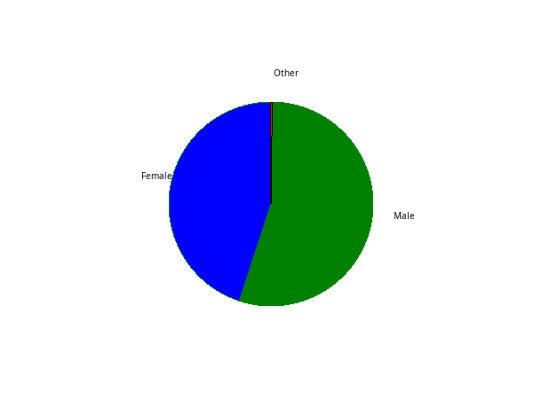
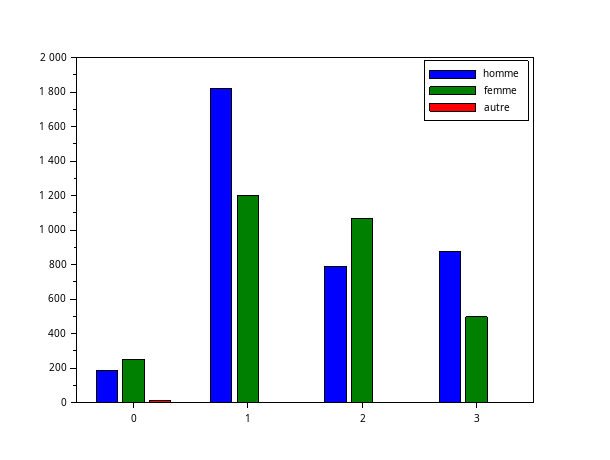
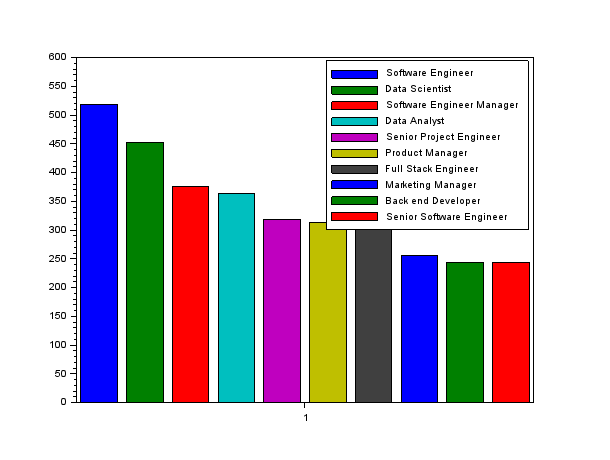
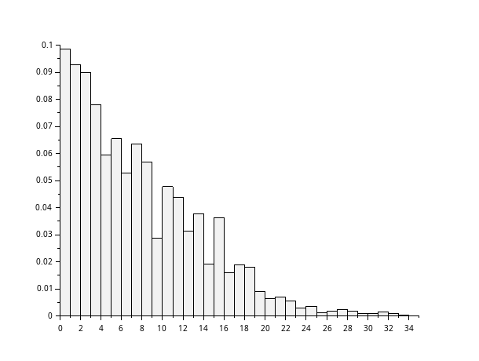
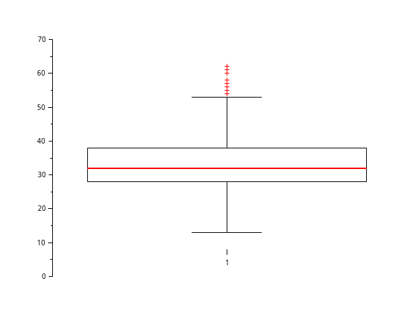

# EXO 1:
**Données:**

    X = csvRead('data.csv',[],[],'double') ==> les chiffres
    Y = csvRead('data.csv',[],[],'double') ==>female et males

  **Question 1:** 
  
   Donnez sous forme de camembert la répartition des genres.

* genre = tabul(csvString(:,3),"i")                   

'U+2794' cela permet de récupèrer la liste des genres ainsi que leur occurence

        ->genre(1)
        ->genre(2)                                      //donne l'occurence correspondant aux valeurs de "genre(1)"

    pie(genre(2),genre(1))                              //fais sous forme d'un camembert la representation des genres en fonction de leur occurence

**Résultat**

  **Question 2:**
  
   Donnez sous forme d'histogramme la répartition des niveaux d'études, suivants le genre.

**Reponse:**

genre_lvl = [csvString(:,3),csvString(:,4)]                                     // crée une matrice 6699x2 avec les genres et le niveau d'études

high_homme = length(find(genre_lvl(:,2) == "0" & genre_lvl(:,1) == "Male"))     // renvoie l'occurence d'hommes ayant un niveau d'étude de 0

high_femme = length(find(genre_lvl(:,2) == "0" & genre_lvl(:,1) == "Female"))   // renvoie l'occurence des femmes ayant un niveau d'étude de 0

high_autre = length(find(genre_lvl(:,2) == "0" & genre_lvl(:,1) == "Other"))    // renvoie l'occurence des autres ayant un niveau d'étude de 0

b_homme = length(find(genre_lvl(:,2) == "1" & genre_lvl(:,1) == "Male"))        // renvoie l'occurence d'hommes ayant un niveau d'étude de 1

b_femme = length(find(genre_lvl(:,2) == "1" & genre_lvl(:,1) == "Female"))      // renvoie l'occurence des femmes ayant un niveau d'étude de 1

b_autre = length(find(genre_lvl(:,2) == "1" & genre_lvl(:,1) == "Other"))       // renvoie l'occurence des autres ayant un niveau d'étude de 1

m_homme = length(find(genre_lvl(:,2) == "2" & genre_lvl(:,1) == "Male"))        // renvoie l'occurence des hommes ayant un niveau d'étude de 2

m_femme = length(find(genre_lvl(:,2) == "2" & genre_lvl(:,1) == "Female"))      // renvoie l'occurence des femmes ayant un niveau d'étude de 2

m_autre = length(find(genre_lvl(:,2) == "2" & genre_lvl(:,1) == "Other"))       // renvoie l'occurence des autres ayant un niveau d'étude de 2

d_homme = length(find(genre_lvl(:,2) == "3" & genre_lvl(:,1) == "Male"))        // renvoie l'occurence des hommes ayant un niveau d'étude de 3

d_femme = length(find(genre_lvl(:,2) == "3" & genre_lvl(:,1) == "Female"))      // renvoie l'occurence des femmes ayant un niveau d'étude de 3

d_autre = length(find(genre_lvl(:,2) == "3" & genre_lvl(:,1) == "Other"))       // renvoie l'occurence des autres ayant un niveau d'étude de 3

temp = [high_homme, high_femme, high_autre;b_homme, b_femme, b_autre;m_homme, m_femme, m_autre;d_homme, d_femme, d_autre]   //crée un tableau 

lvlEtude = [0,1,2,3]

bar(lvlEtude,temp);

legend("homme","femme","autre")

**Résultat:**

**Question3:**

Donnez sous forme d'histogramme, les effectifs des 10 professions les plus représentées.

**Réponse:**

metiers = tabul(csvString(:,5),"i")                                 //récupère la liste des profession ainsi que leur occurence

[occu,indice] = gsort(metiers(2))                                   //donne la liste des occurence trié ainsi que l'indice que son indice avant le 

profession = metiers(1)                                             //stock la liste des profession dans une variable

matrice_occurence = [occu(1:1),occu(2:2),occu(3:3),occu(4:4),occu(5:5),occu(6:6),occu(7:7),occu(8:8),occu(9:9),occu(10:10)]

bar(matrice_occurence)                                              //affiche l'histogramme des 10 professions avec le plus de monde

legend(profession(indice(1:10)))                                    //légende le graphe pour donner un nom à chaque colonne

**Résultat:**

**Question 4:**

4)  Quelle est la profession la plus fréquente des femmes ? des hommes ?

**Re^ponse:**

indice_female = find(csvString(:,3) == "Female")        //récupère les indice de la colonne 3 de data.csv contenant "Female"

[valeurs] = csvString(indice_female,5)                  //récupère les métiers situés aux indices récupérés précédemment

metiers_female = tabul(valeurs)                         //récupère les métiers sans doublons ainsi que leur occurence

[occurence_tri,indice_tri] = gsort(metiers_female(2))   //récupère et trie dans un tableau ce qu'on a relevé précédemment et relève leur indice d'avant

liste_metiers_female = metiers_female(1)                //récupère dans une variable la liste des métiers unique dans le but de la parcourir par indice

liste_metiers_female(119)                               //relève le métiers recensant le plus de femmes

 indice_male = find(csvString(:,3) == "Male")            //récupère les les indice de la colonne 3 de data.csv contenant "Male"

[valeurs2] = csvString(indice_male,5)                   //récupère les métiers situés aux indices récupérés précédemment

metiers_male = tabul(valeurs2)                          //récupère les métiers sans doublons ainsi que leur occurence

[occurence_tri,indice_tri] = gsort(metiers_male(2))     //récupère et trie dans un tableau ce qu'on a relevé précédemment et relève leur indice d'avant

liste_metiers_male = metiers_male(1)                    //récupère dans une variable la liste des métiers unique dans le but de la parcourir par 
indice

liste_metiers_male(11)                                  //relève le métiers recensant le plus d'hommes

 _________       _______________________
|**Homme**| ==> | **Software Engineer** |
|_________|     |_______________________|

                                                        
 _________       ____________________
|**Femme**| ==> | **Data Scientist** |
|_________|     |____________________|

  **Question5:**
Pour chaque niveau d'études, donnez le salaire moyen, l'âge moyen et l'expérience moyenne.
**Reponse:**

indice_high = find(csvDouble(:,4) == 0 )

salaire_high = csvDouble(indice_high,7)

mean(salaire_high)                                      //36706.694

age_high = csvDouble(indice_high,2)

mean(age_high)                                          //26.854911

exp_high = csvDouble(indice_high,6)

mean(exp_high)                                          //1.9151786

indice_b = find(csvDouble(:,4) == 1 )

salaire_b = csvDouble(indice_b,7)
mean(salaire_b)                                         //95082.909

age_b = csvDouble(indice_b,2)

mean(age_b)                                             //30.260179

exp_b = csvDouble(indice_b,6)

mean(exp_b)                                             //5.4195631

indice_m = find(csvDouble(:,4) == 2 )

salaire_m = csvDouble(indice_m,7)

mean(salaire_m)                                         //130112.06

age_m = csvDouble(indice_m,2)

mean(age_m)                                             //35.171505

exp_m = csvDouble(indice_m,6)

mean(exp_m)                                             //9.6456989

indice_p = find(csvDouble(:,4) == 3)

salaire_p = csvDouble(indice_p,7)

mean(salaire_p)                                         //165651.46

age_p = csvDouble(indice_p,2)

mean(age_p)                                             //41.154858

exp_p = csvDouble(indice_p,6)

mean(exp_p)                                             //13.915267

**Question 6:**

Pour chaque genre, donnez le salaire moyen, l'âge moyen et l'expérience moyenne.

**Réponse:**

indice_6_female = find(csvString(:,3) == "Female" )

salaire_6_female = csvDouble(indice_6_female,7)

mean(salaire_6_female)					                //107889.00

age_6_female = csvDouble(indice_6_female,2)

mean(age_6_female)					                    //32.626286

exp_6_female = csvDouble(indice_6_female,6)

mean(exp_6_female)					                    //7.4201792

indice_6_male = find(csvString(:,3) == "Male" )

salaire_6_male = csvDouble(indice_6_male,7)

mean(salaire_6_male)					                //121389.87

age_6_male = csvDouble(indice_6_male,2)

mean(age_6_male)					                    //34.416394

exp_6_male = csvDouble(indice_6_male,6)

mean(exp_6_male)					                    //8.6169662

indice_6_other = find(csvString(:,3) == "Other" )

salaire_6_other = csvDouble(indice_6_other,7)

mean(salaire_6_other)					                //125869.86

**.**age_6_other = csvDouble(indice_6_other,2)

mean(age_6_other)					                    //39.571429

exp_6_other = csvDouble(indice_6_other,6)

mean(exp_6_other)					                    //16.428571

  

# EXO2 
**question 1:** Donnez sous forme d'histogrammes la distribution des ages.
**Réponse:**
'''scilab
age = X(:, 2);
min_age = min(age); 
max_age = max(age);  
histplot(41,age);
**Resultat:**

**Question2:** Donnez sous forme d'histogrammes la distribution de l'expérience.
**Réponse:**

exp = X(:,6);
min_xp = min(exp);
max_xp = max(exp);
histplot(34,exp);
**Résultat:**

**Question 3:** Donnez les quartiles, interquatiles, min,max, moyenne, mediane, mode, et ecart type de l'age.

**Réponse:**
'''scilab
Q = quart(age)

IQR = Q(3) - Q(1) 

min_age = min(age);

max_age = max(age);

mean(age)

median(age)

unique_vals = unique(age);
freq = histc(ages, unique_vals);
[max_freq, max_index] = max(freq);
age_mode = unique_vals(max_index);

**Question 4** A l'aide du paquet stixbox, tracez une boite à moustache pour l'age.

**Réponse:**
 atomsInstall("stixbox");
 boxplot(age);

 

4. Refaire les questions précédentes pour l'expérience.
Q = quart(exp) 
IQR = Q(3) - Q(1)
min_xp = min(exp); 
max_xp = max(exp); 
mean(exp)
median(exp)

Unique_vals = unique(exp);
Freq = histc(exp, Unique_vals);
[max_Freq, max_Index] = max(Freq);
exp_mode = Unique_vals(max_Index);

boxplot(exp);

EXO3

    Donnez, sous forme d'histogramme la distribution des salaires, suivant le genre.
    Tracez un histogramme des salaires moyens suivants le niveau d'études.
    Donnez les quartiles, interquatiles, min,max, moyenne, mediane, et ecart type des salaires. Tracez une boite à moustaches.
    Refaire la question précédente, en distingant les genres. Tracez une boîte à moustache pour chaque genre. Commentaires ?

ExO4

    Tracez un nuage de points (age,salaire), et la droite de regression correspondante. Quel est le coefficient de corrélation ?
    Tracez un nuage de points (expérience,salaire), et la droite de regression correspondante. Quel est le coefficient de corrélation ?

ExO5

    Tracez un nuage de points (salaire,expérience) pour les hommes et les femmes, ainsi que les droites de regression associées. Commentaire ?
    Tracez un nuage de points (salaire,expérince) et les droites de regression associées pour chaque niveau d'études. Commentaire ?

Pour séparer les genres, je fais les commandes suivantes :
--> nb_bac1_homme = sum(etude == 1 & genre == "Male");
--> nb_bac2_homme = sum(etude == 2 & genre == "Male");
--> nb_bac3_hommes = sum(etude == 3 & genre == "Male");

--> nb_bac_femme = sum(etude == 0 & genre == "Female");
--> nb_bac1_femme = sum(etude == 1 & genre == "Female");
--> nb_bac2_femme = sum(etude == 2 & genre == "Female");
--> nb_bac3_femme = sum(etude == 3 & genre == "Female");

-> nb_bac_other = sum(etude == 0 & genre == "Other");
--> nb_bac1_other = sum(etude == 1 & genre == "Other");
--> nb_bac2_other = sum(etude == 2 & genre == "Other");
--> nb_bac3_other = sum(etude == 3 & genre == "Other");

Je crée 3 tableaux pour séparer les genres sur 
--> y_hommes = [nb_bac_homme; nb_bac1_homme; nb_bac2_homme; nb_bac3_hommes];
--> y_femmes = [nb_bac_femme; nb_bac1_femme; nb_bac2_femme; nb_bac3_femme];
--> y_other = [nb_bac_other; nb_bac1_other; nb_bac2_other; nb_bac3_other];

J'affiche ensuite le diagramme
--> legend("homme","femme","other")
--> bar([y_hommes y_femmes y_other], 'grouped');

[def]: camembert_genre_1.1.png